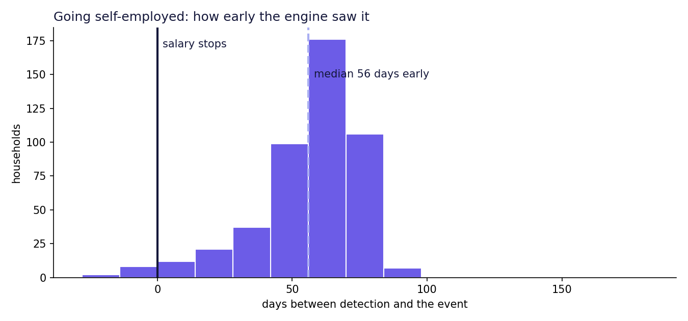
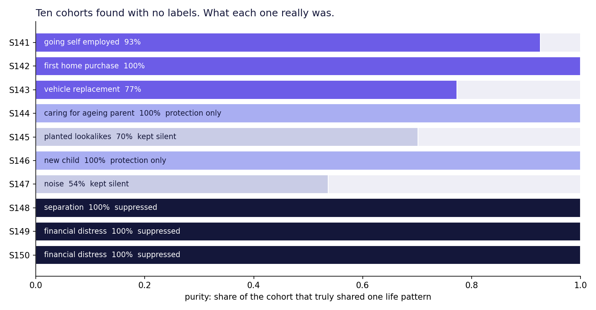

# Situation 141

**Kate's first 140 proactive situations were written by people. The 141st wrote itself.**

KBC's digital assistant Kate reaches out in more than 140 situations. Every one of them was authored by a person who noticed a pattern. So the real limit on how well KBC understands its customers is not data: it is how fast people can think of the next situation.

Situation 141 is a discovery engine. It watches how each household moves away from **its own** normal, groups households whose lives bent in the same way, names each group in plain language, measures how early it was visible, and blocks anything a bank must never sell against. A human approves what reaches Kate. Kate never acts on her own.

Built for the Tectonic Hackathon, KBC challenge.

---

## Results

On 10,000 synthetic Belgian households with 8 hidden life patterns, which the engine was never told about:

| | |
|---|---|
| Hidden life patterns recovered, with no labels | **7 of 8** |
| Self-employment cohort purity | **93%** (339 of 389 true households captured) |
| Warning before the salary stops, on households the engine never saw | **median 56 days** (49 to 63), **98%** seen before the event |
| Cohorts the ethics gate handled correctly | **7 of 7** |
| Messages sent, vs contacting on any change | **135 vs 617**, 78% fewer |
| Messages at the right moment | **96%** vs 38% |
| Messages to separating or distressed households | **0** vs 152 |
| Cohort purity, real labels vs shuffled labels | 0.89 vs 0.28 (shuffled equals chance) |

The one pattern it missed, subscription creep, is too common in ordinary life to separate from normal behaviour. We think that is the honest outcome.

Full report: [`out/eval_report.md`](out/eval_report.md)




### What these results do and do not show

We generated this data ourselves. The results prove that the method works end to end and can recover structure it was never told exists. **They are not evidence of how accurate it would be on real KBC customers.** Real households change several things at once, and precision will be lower. That is the next test, on KBC's own data.

For the same reason, the supervised benchmark in the report reaches about 0.99 ROC-AUC. That reflects how cleanly the pattern was planted, not real-world performance. We report it, we do not headline it.

---

## How it works

```
events ──► self-relative features ──► encoder ──► bends ──► cohorts ──► gate ──► ranked situations ──► reviewer ──► Kate
            (the one cut function)     (no labels)  (sustained)  (HDBSCAN)   (ethics)    (silence by cutoff)
```

1. **Every household is its own control.** A family of five and a single starter are not comparable, so we never compare them. Each feature measures how far a household has moved from its own last 44 weeks. A category it has never paid before counts heavily.
2. **The cut.** One function decides which weeks a feature may see, and it can only see the past. A test scrambles the future and checks nothing changes.
3. **Encoder.** A linear self-supervised encoder (PCA on self-relative features), fitted on training households only. No labels.
4. **Bends.** A sustained departure from the household's own normal: two consecutive checks above threshold. The bend date is the second one, the first moment the bank could act.
5. **Discovery.** HDBSCAN clusters the direction of each bend, not its size. Each cluster is a candidate life moment nobody wrote.
6. **Stability.** Re-cluster early and late bends separately. Real structure reappears; noise does not.
7. **Gate.** If a cohort's signature relies on health, separation or financial distress evidence, or implies it (baby-shop spending before a birth implies pregnancy), it is suppressed or limited to protection before any person sees it as an opportunity.
8. **Ranking and silence.** Cohort size, lead time, stability, and whether KBC already has a rule. Anything below the cutoff stays silent. Silence is logged like speech.

### The hard-negative test

Precision is measured against lookalikes, not random households. We planted 1,072 households that look like they are about to change and do not: people buying equipment without leaving their job, people browsing houses, people with side income while employed.

The engine put 85 of the side-income lookalikes into **their own cohort** (S145), separate from real self-employment (S141), because they lack the registration payments. The ranking then kept that cohort silent.

---

## Run it

```bash
pip install -r requirements.txt
./run_all.sh                 # about 3 minutes: generate, discover, evaluate, build console, test
open out/console.html        # no server needed
```

Or step by step:

```bash
python -m generator.generate --n 10000 --seed 141 --out data
python -m pipeline.run                    # label-free. Never opens the answer key.
python -m evaluation.evaluate             # the only module that opens data/answer_key.json
python -m evaluation.export_demo
python -m app.build_console
python -m pytest -q tests/
```

API:

```bash
python -m api.make_tokens                 # writes a gitignored .env with HASHED tokens, prints raw tokens once
uvicorn api.main:app --port 8141
```

---

## Repository

| Path | What it is |
|---|---|
| `schemas/contracts.json` | Every object every track codes against |
| `generator/` | Synthetic households, 8 planted patterns, hard negatives. `patterns.py` is sealed from the pipeline |
| `pipeline/features.py` | Self-relative features and the single cut function |
| `pipeline/encoder.py` | Encoder and bend detection |
| `pipeline/discover.py` | Clustering, stability, gate, coverage, naming, ranking |
| `pipeline/run.py` | Runs the pipeline end to end |
| `evaluation/` | Opens the sealed key. Scores discovery, lead time, gate, holdout, contact policy, controls |
| `api/` | FastAPI service: reviewer console and the customer's own view |
| `app/` | Discovery console |
| `tests/` | Leakage, gate, and API security tests |
| `docs/` | Video script and submission description |

---

## Security

Written against what the Aikido audit checks. See [`SECURITY.md`](SECURITY.md).

- **Authentication:** bearer tokens, stored only as SHA-256 hashes, compared in constant time
- **Authorization:** customer, analyst, reviewer. Analysts read, only reviewers approve
- **IDOR:** no customer endpoint takes a household id. Identity comes from the token
- **Business logic:** a gate-blocked situation cannot be approved, enforced on the server
- **Least surface:** there is no endpoint to look up an arbitrary household
- **Hardening:** strict input models (unknown fields rejected), body size limit, rate limit, security headers, audit log

---

## Known limitations

- **The pipeline's own lead-time estimate is weak.** Its label-free guess of when the life event lands is off by a mean of 59 days. The lead times we report come from the sealed truth on holdout households, never from that estimate. Improving it is the first piece of follow-up work.
- **Encoder.** A linear encoder, because the build environment had no torch. A transformer over raw event sequences, as in Revolut's PRAGMA and Nubank's nuFormer, is the scale-up path. The interface is unchanged.
- **Coverage register.** Our list of what Kate already covers comes from KBC's public releases, not its internal catalogue.
- **Synthetic data.** See above. This validates the method, not real-world precision.
- **Financial distress** is mostly detected after it starts (a median of 49 days after). It is suppressed either way, so it never reaches a customer as an offer.

---

## Why this approach

Kate is excellent at "something just happened": a duplicate payment, a wrong PIN, a storm. Those rules fire after a confirmed event. A KBC executive told us his bank reminded him about home insurance a few weeks after he moved house. Correct, and too late.

The published evidence says a bank can see further ahead. Revolut's PRAGMA foundation model (April 2026) reports large gains when one model learns from banking event sequences across many tasks. A peer-reviewed study on a large European bank found that life events can be predicted from transaction data better than chance, with fine-grained transactions carrying the most weight.

We did not try to write situation 141. We built the thing that finds it.
